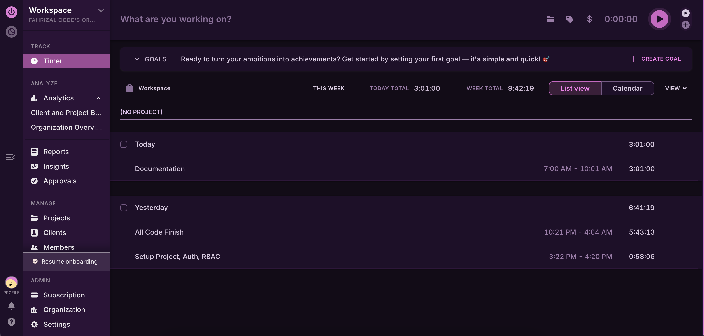
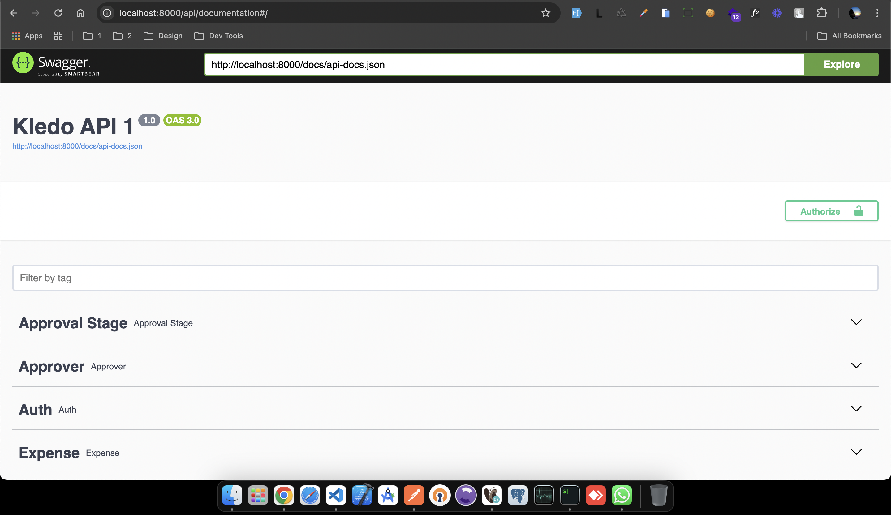

<p align="center">
  <a href="https://laravel.com" target="_blank">
    
  </a>
</p>

# 🚀 Kledo Test

A **simple project** designed for the **Kledo competency assessment**.

---

## 🛠️ System Requirements

-   **PHP** `8.2`
-   **Laravel** `9`
-   **MySQL** `8+`
-   **Composer** (Latest version)

---

## 📌 Installation

Follow these steps to set up the project on your local machine.

### 1️⃣ Clone the Repository

Start by cloning the repository and navigating into the project directory:

```bash
git clone https://github.com/yusuffahrizal/kledo-test.git
```

```bash
cd kledo-test
```

### 2️⃣ Install Dependencies

Before running the project, install the required dependencies using Composer:

```bash
composer install
```

### 3️⃣ Configure the Environment

Set up the application environment by copying the example .env file and generating a unique application key:

```bash
cp .env.example .env && php artisan key:generate
```

Then, configure the database connection in the .env file:

```bash
DB_CONNECTION=mysql
DB_HOST=127.0.0.1
DB_PORT=3306
DB_DATABASE=laravel
DB_USERNAME=root
DB_PASSWORD=
```

### 4️⃣ Run Database Migrations & Seeders

Run the following command to create and populate the database:

```bash
php artisan migrate:fresh --seed
```

This will:

✅ Drop all existing tables

✅ Recreate the database schema

✅ Populate the database with seed data

### 5️⃣ Install & Configure Authentication

To enable API authentication, install Laravel Passport:

```bash
php artisan passport:install -n
```

### 6️⃣ Start the Application

Run the Laravel development server:

```bash
php artisan serve
```

Your application will be accessible at: http://127.0.0.1:8000 🚀

---

## 🧪 Running Tests

To ensure everything is working correctly, follow these steps to set up and run tests.

### 1️⃣ Set Up the Testing Environment

Copy the .env file and create a testing environment configuration:

```bash
cp .env.example .env.testing
```

Then, configure the testing database inside .env.testing:

```bash
DB_CONNECTION=mysql
DB_HOST=127.0.0.1
DB_PORT=3306
DB_DATABASE=laravel_testing  # Use a separate test database
DB_USERNAME=root
DB_PASSWORD=
```

### 2️⃣ Run Tests

Execute the following command to run the test suite:

```bash
composer test
```

This will run all unit and feature tests to ensure the application is functioning correctly.

---

## ⏳ Time Tracker

<p align="center">

</p>

This project includes a Time Tracker feature to monitor time-based activities efficiently.

---

## 📄 API Documentation

<p align="center">

</p>

This project includes Swagger API documentation for easy API exploration and testing.

🔗 Access the documentation at:

```bash
/api/documentation
```

---

## 🎯 You're All Set!

